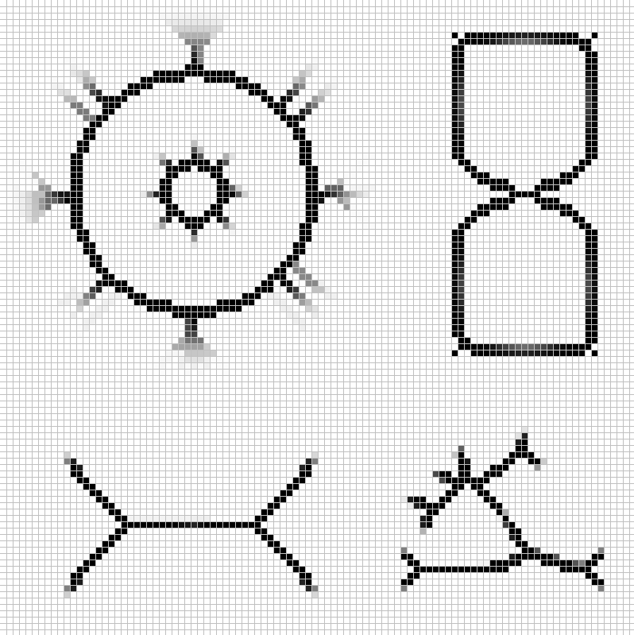
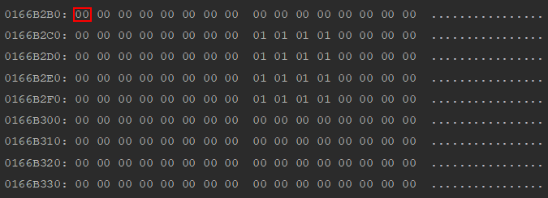
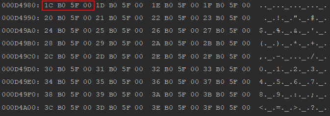
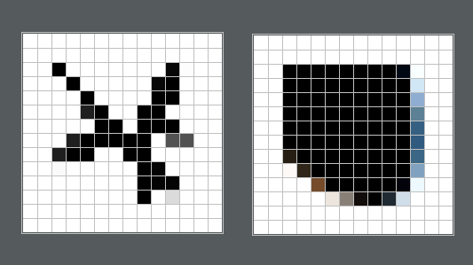
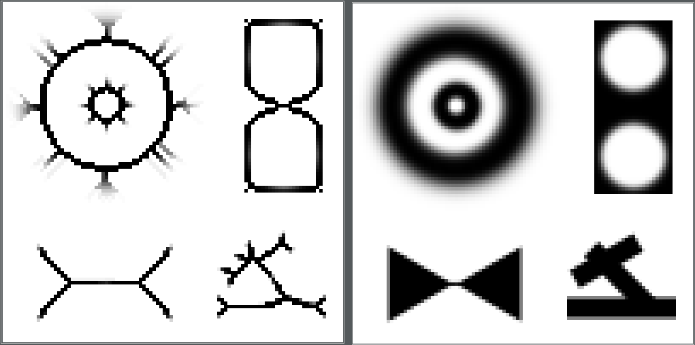

# Eredmények
A legnagyobb középpontnál kisebb szomszédra állítást követően az eredmények a következők lettek:

* Fekete-fehér képen:

* Fekete-fehér képen, a módosított törléssel:

# Lookup table
A szöveges dokumentum alkalmatlannak bizonyult ilyen sok új sort használó algoritmushoz, így inkább bináris
fileokat hoztam létre.

* A bináris fileban(lookup) végigmentem az összes lehetséges eseten, amikor a a bináris tesztmátrixokon a
középpont törölhető 1-et, ha nem törölhető 0-t raktam a file-ba. Minden egyes
ilyen cimkézést 1 byte-on tároltam. Ennek a mérete 32 MB lett.

* Egy másik megvalósításban csupán azoknak a pontoknak a 10-es számrendszerbeli értékét mentettem el, melyek
törölhetőek. Ezeket 4 byte-on mentettem el. Ez a file 4.98 MB lett.

A Vékonyítások eredménye megegyezik, az időbeli különbségek pedig a következők:

`Eredeti: 1.57s`    `Lookup: 22.14s`    `Lookup_index: 73.74s`

`Eredeti: 15.06m`     `Lookup: 14.70m`    `Lookup_index:123.48m`

`Eredeti: 27.54m`    `Lookup:27.55`    `Lookup_index:?`
