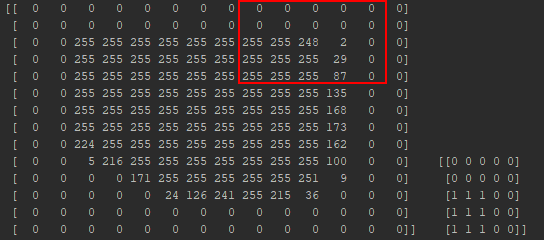
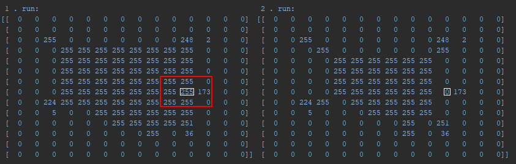
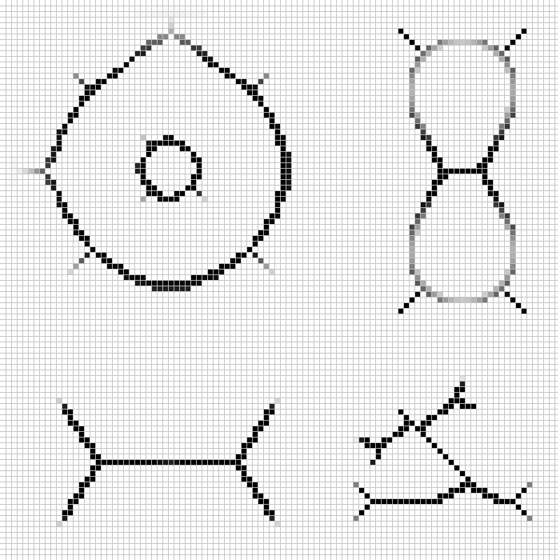
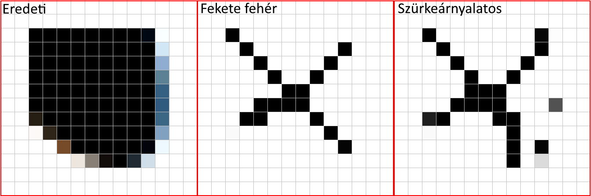
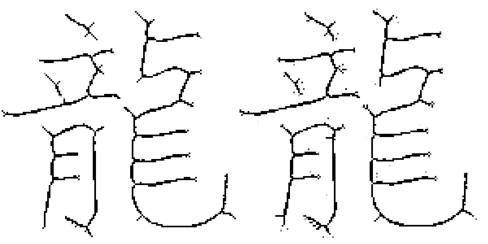

# Szürke árnyalatosra konvertálás

A konvertálás során minden egyes ponthoz külön alakítjuk ki a bináris képet. A küszöbértékünk ehhez a pont intenzitása.
A nála kisebb pontokat 0-ra, a nagyobbakat, vagy egyenlőket 1-re állítjuk, majd ezeken a kissebb mátrixokon hajtjuk 
végre a törölhetőség vizsgálatát (akár keresőtáblával).

Ezzel az a probléma, hogy amikor egy a mátrixon látszólag törölhető pontot eltávolítunk, az szakadást eredményez a 
kisebb intánzitású és a törölt pont által összekötött objektum között.

Az ilyen szakadások ellen nem véd egyik feltételünk sem, mivel a feltételek a küszöbölés után jönnek szóba.

Az eddig megírt algoritmus jól működik fekete-fehér képeken, egy saját végpontfeltétellel, aminek lényege, hogy 
megtartja azokat a képpontokat, melyeknek egy 4-szomszédjuk van, vagy egy 8-szomszédjuk.

# Eredmények

* Fekete-fehér képen:

* Fekete-fehér összehasonlítása a szürkeárnyalatos képpel:

